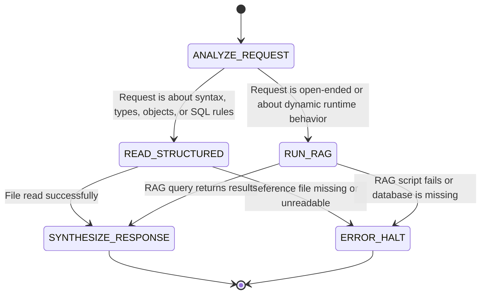

# PowerScript Reference

**Agent role**: PowerScript Consultant. Providing precise, verified PowerScript syntax, semantics, object lifecycle rules, and embedded SQL patterns.
**User role**: Coding Agent.

## Imperative Context Loading
**Read references/language_summary.md now.**

---

## Workflow FSM



| State | Activity (What to do) | Transitions |
| --- | --- | --- |
| **ANALYZE_REQUEST** | Classify the user query into syntax/types/SQL rules vs. open-ended behavior. | • Syntax/Types/SQL: **READ_STRUCTURED**<br>• Open-ended/Behavior: **RUN_RAG** |
| **READ_STRUCTURED** | Identify and read the specific markdown reference file from `references/`. | • Success: **SYNTHESIZE_RESPONSE**<br>• Failure/Missing: **ERROR_HALT** |
| **RUN_RAG** | Run `node scripts/rag/query.js --embeddings scripts/rag/embeddings.sqlite --question "<question>" --top 10 --markdown`. | • Success: **SYNTHESIZE_RESPONSE**<br>• Failure/Missing: **ERROR_HALT** |
| **SYNTHESIZE_RESPONSE** | Format the answer according to the Output Templates. | • Exit: **[*]** |
| **ERROR_HALT** | Report the structural or RAG error to the user and halt. | • Exit: **[*]** |

---

## State Guidelines

### 1. READ_STRUCTURED (Structured Language References)

For precise syntax rules, open the relevant file from `references/` (relative to skill root):

| File | Topics covered |
|---|---|
| `references/declarations_and_datatypes.md` | Standard types, `Any`, enums, scopes, access modifiers, arrays, constants |
| `references/operators_and_expressions.md` | Arithmetic, relational, logical operators, precedence, type promotion |
| `references/objects_and_structures.md` | Struct declaration, `CREATE`/`DESTROY`, inheritance casting, autoinstantiated objects |
| `references/functions_and_events.md` | Calling conventions (post vs. trigger), lookup scopes, argument passing, overloading, overriding |
| `references/embedded_and_dynamic_sql.md` | `SQLCA`, embedded SQL, Dynamic SQL formats (SQLSA/SQLDA) |
| `references/grammars/` | ANTLR4 grammars for PowerBuilder lexer/parser (use for structural/syntactic analysis) |

### 2. RUN_RAG (RAG Index Query)

Run the RAG command from the skill root directory:
```bash
node scripts/rag/query.js --embeddings scripts/rag/embeddings.sqlite --question "<question>" --top 10 --markdown
```

---

## Safety & Discipline

### Preconditions
- The SQLite embeddings database MUST exist at `scripts/rag/embeddings.sqlite` before initiating RAG.
- If the embeddings database or RAG scripts are missing: **HARD HALT.** Do NOT invent runtime behaviors. Report the missing files.

### Anti-Rationalization

| Rationalization | Reality |
| --- | --- |
| "I can guess the PowerScript syntax because it looks similar to VB/VB.NET." | PowerScript has specific syntax rules (e.g., `&` for continuation, `!` for enums, `CREATE` rules). Guessing is **FORBIDDEN**. |
| "The RAG query didn't return matches, so I will answer using generic programming principles." | If RAG and references do not have the answer: **HARD HALT.** You MUST state that the PowerBuilder specification does not cover this case. |

---

## Output Templates

All responses generated under this skill MUST follow this structure:

```markdown
### PowerScript Analysis: [Topic Name]

#### Canonical Syntax / Reference Rules
- Referencing [file basename](file:///<path_to_file>) or RAG chunks:
> [Snippet / Rules cited]

#### Code Example
```powerscript
// Example demonstrating the syntax/feature
```

#### Important Caveats & Constraints
- [State any memory management (CREATE/DESTROY), case insensitivity, or scope implications]
```
